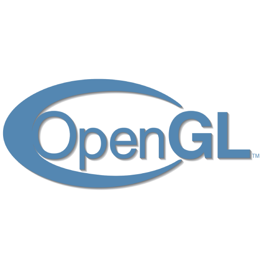
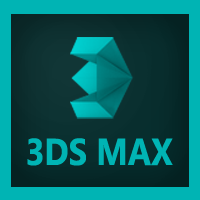

<!-- ### Hi there 👋 -->

<!--
**Melell/Melell** is a ✨ _special_ ✨ repository because its `README.md` (this file) appears on your GitHub profile.

Here are some ideas to get you started:

- 🔭 I’m currently working on ...
- 🌱 I’m currently learning ...
- 👯 I’m looking to collaborate on ...
- 🤔 I’m looking for help with ...
- 💬 Ask me about ...
- 📫 How to reach me: ...
- 😄 Pronouns: ...
- ⚡ Fun fact: ...
-->

<h1 align="center">Hi 👋, I'm Miguel Echeverria</h1>
<h3 align="center">A C++ programmer currently working as a live gameplay engineer at Playground Games, in the Forza Horizon franchise</h3>

- 👨‍💻 All of my projects are available in [my webpage](https://www.miguel-echeverria.com)

- 📫 How to reach me **m.echeverriamajadas@gmail.com**

- 📄 Know about my experiences on [my LinkedIn](https://www.linkedin.com/in/miguel-echeverria-majadas)

<h3 align="left">Connect with me:</h3>

<h3 align="left">Languages / APIs:</h3>

    
    
    
    
    

<h3 align="left">Game Engines:</h3>

    
    

<h3 align="left">Version Control:</h3>

    
    

<h3 align="left">IDEs / Editors:</h3>

    
    
    

<h3 align="left">Other Software:</h3>

    
    

